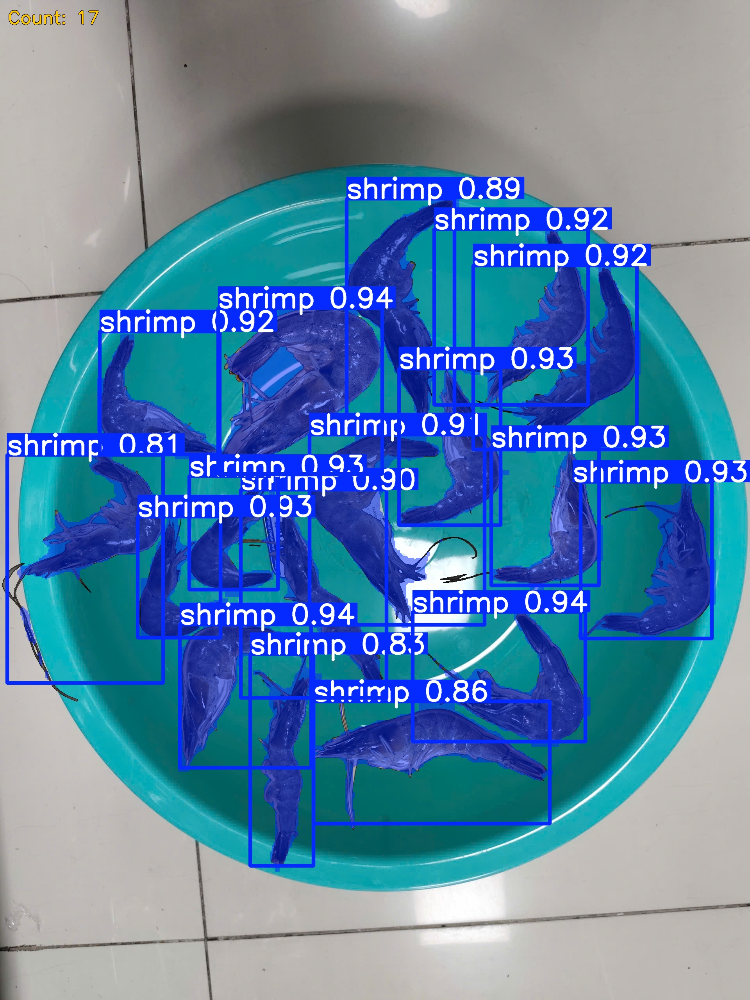
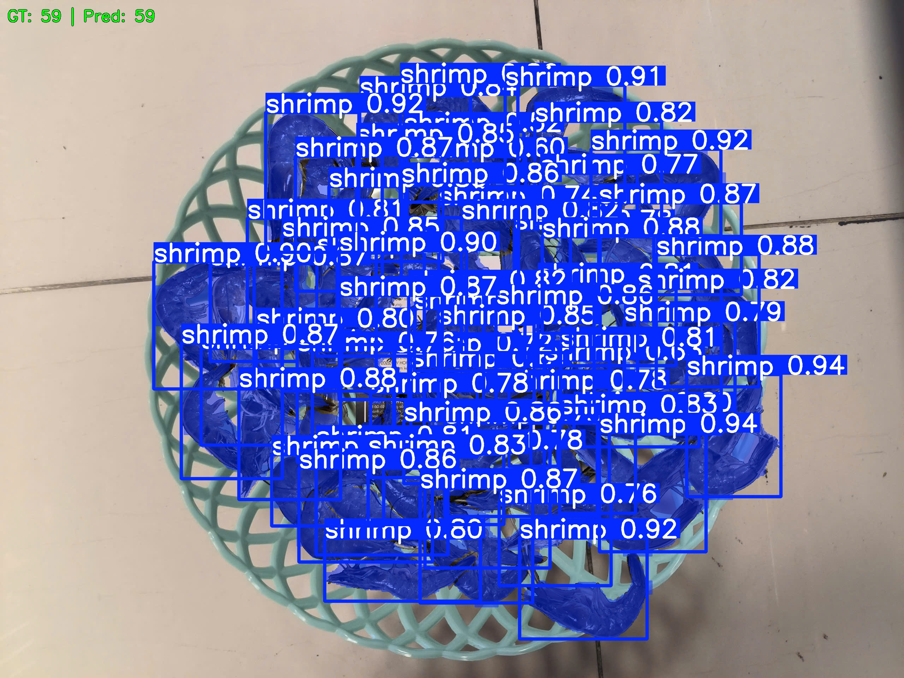
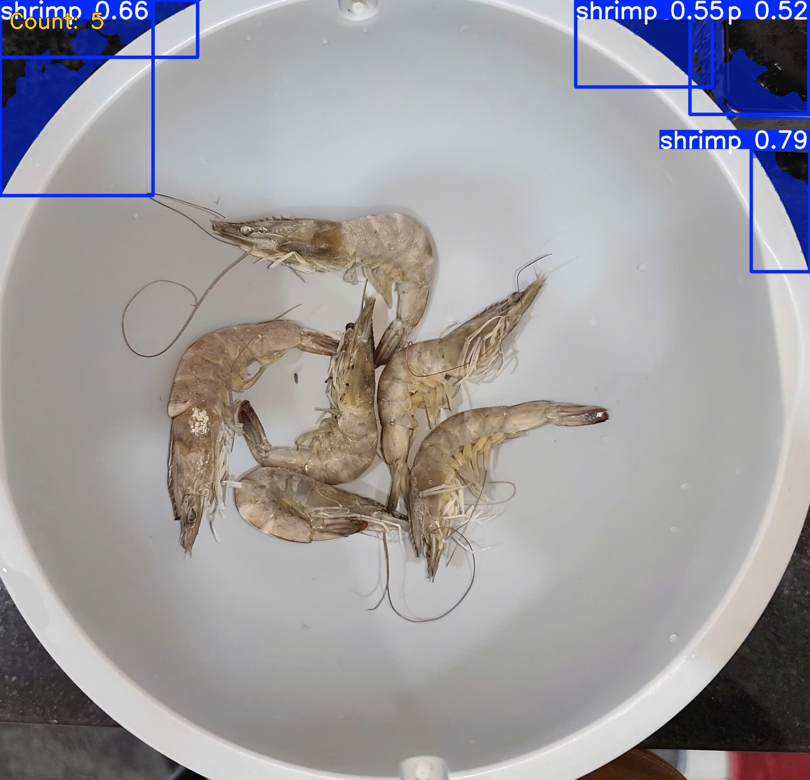
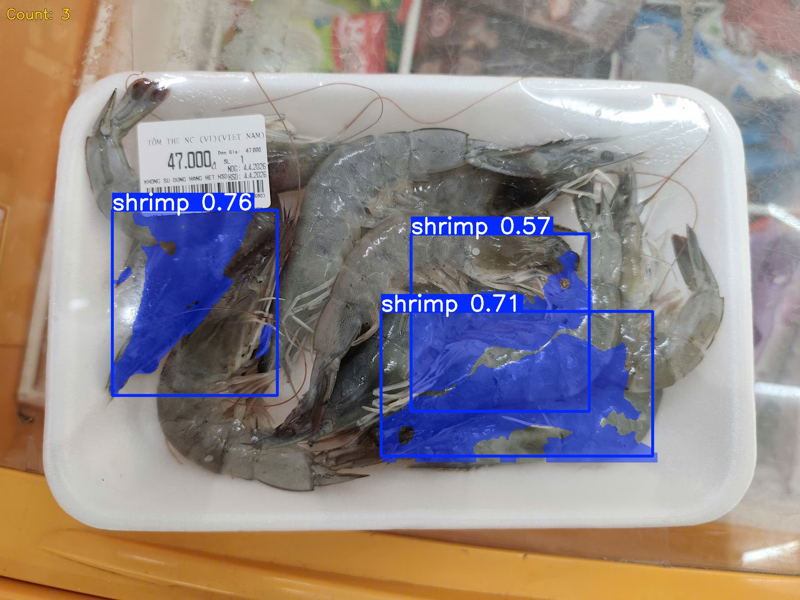
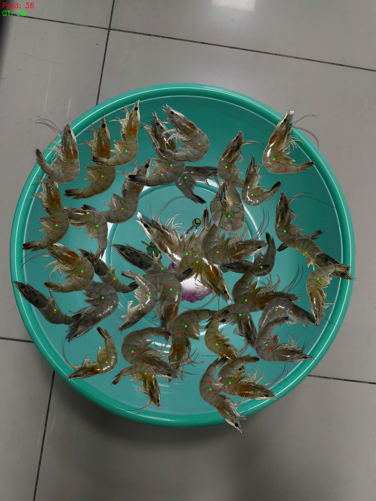
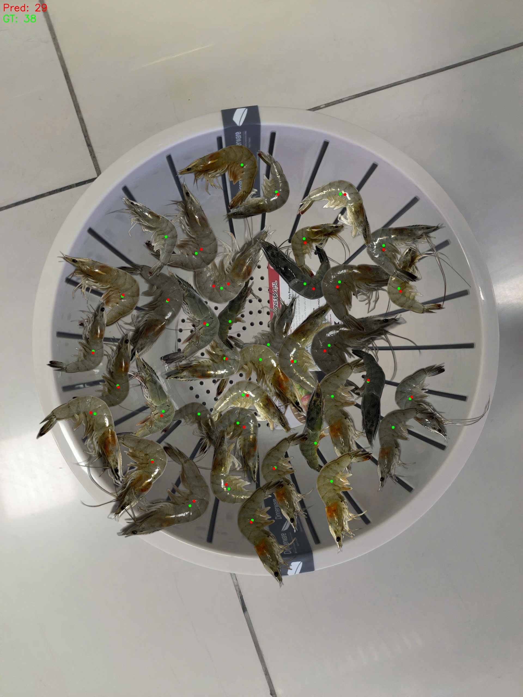
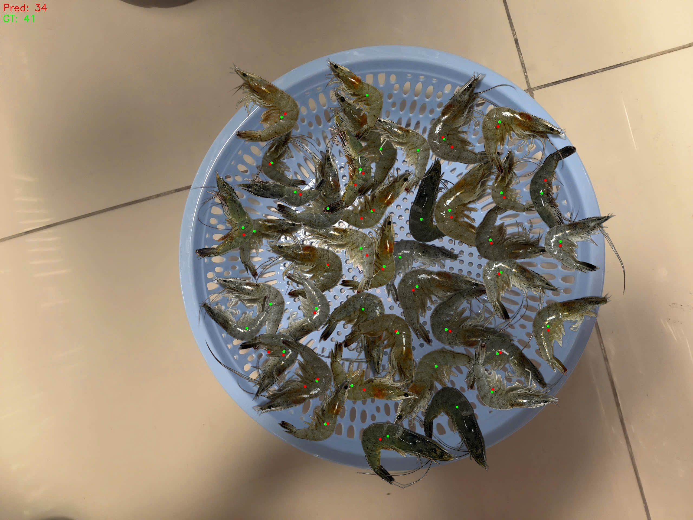

# 🦐 Shrimp Counting Project

A Computer Vision project for **automated shrimp counting** in aquaculture baskets using two complementary deep learning approaches:

1. **YOLOv8-Seg** — Instance segmentation for precise individual shrimp detection
2. **APGCC** — Point-based crowd counting with localization heads

---

## 📸 Demo Results

### YOLOv8 Segmentation
<table>
  <tr>
    <td></td>
    <td></td>
  </tr>
  <tr>
    <td></td>
    <td></td>
  </tr>
</table>

> 🟢 **Green text** = predicted count matches ground truth | 🔴 **Red text** = mismatch | 🟡 **Orange text** = no ground truth (real-world image)

### APGCC Point Detection
<table>
  <tr>
    <td></td>
    <td></td>
    <td></td>
  </tr>
</table>

---

## 📂 Project Structure

```
Shrimp Counting Project/
├── YOLOv8/                          # Instance Segmentation approach
│   ├── src/
│   │   ├── train_yolo.py            # Training script
│   │   └── predict.py               # Inference (single image or folder)
│   ├── dataset/
│   │   └── shrimp.yaml              # Dataset config for YOLO
│   └── example/result/              # Sample prediction outputs
│
├── APGCC/                           # Point-based Counting approach
│   ├── src/
│   │   ├── core/
│   │   │   ├── train_shrimp.py      # Training script
│   │   │   └── evaluate_shrimp.py   # Evaluation & inference
│   │   ├── preprocessing/
│   │   │   └── prepare_shrimp_data.py
│   │   └── utils/
│   │       ├── tune_threshold.py    # Find optimal detection threshold
│   │       └── register_shrimp_dataset.py
│   ├── apgcc/                       # APGCC core library
│   ├── datasets/
│   │   └── shrimp_dataset.py        # Custom dataset loader
│   ├── configs/
│   │   └── SHRIMP_train.yml         # Training configuration
│   └── example/result/              # Sample prediction outputs
│
└── Generate Synthetic Dataset/      # Synthetic data generation pipeline
    ├── src/
    │   ├── generate_synthetic_dataset.py  # Main generation script
    │   ├── preprocessing/
    │   │   ├── process_foreground.py  # Background removal (rembg)
    │   │   └── find_basket_params.py  # Basket circle detection (RANSAC)
    │   ├── augmentation/
    │   │   ├── data_augmentation.py   # Image augmentation transforms
    │   │   └── shrimp_augmented.py    # Batch augmentation runner
    │   └── visualization/
    │       ├── visualize_baskets.py   # Visualize basket detection
    │       └── visualize_yolo_seg.py  # Visualize YOLO labels
    └── images/
        ├── foreground_raw/            # Raw shrimp images (21 images)
        └── backgrounds/               # Background basket images (18 images)
```

---

## 🏗️ Synthetic Dataset Pipeline

The training data is **fully synthetically generated**:

| Step | Script | Description |
|------|--------|-------------|
| 1 | `process_foreground.py` | Remove background from raw shrimp photos using `rembg` |
| 2 | `find_basket_params.py` | Detect basket circle parameters (center, radius) via RANSAC |
| 3 | `shrimp_augmented.py` | Generate augmented shrimp variants (rotate, flip, color jitter) |
| 4 | `generate_synthetic_dataset.py` | Composite shrimps onto baskets, output YOLO/Points labels |

### Sample Raw Materials

**Shrimp Foreground (raw):**

<table>
  <tr>
    <td></td>
    <td></td>
    <td></td>
    <td></td>
    <td></td>
  </tr>
</table>

**Basket Backgrounds:**

<table>
  <tr>
    <td></td>
    <td></td>
    <td></td>
    <td></td>
  </tr>
</table>

---

## 🚀 Quick Start

### Prerequisites
```bash
pip install -r requirements.txt
```

### 1. Generate Synthetic Dataset
```bash
# Step 1: Remove background from shrimp images
python "Generate Synthetic Dataset/src/preprocessing/process_foreground.py"

# Step 2: Find basket parameters
python "Generate Synthetic Dataset/src/preprocessing/find_basket_params.py"

# Step 3: Generate augmented shrimp variants
python "Generate Synthetic Dataset/src/augmentation/shrimp_augmented.py"

# Step 4: Generate full dataset
python "Generate Synthetic Dataset/src/generate_synthetic_dataset.py"
```

### 2. Train & Predict — YOLOv8
```bash
# Train
python YOLOv8/src/train_yolo.py

# Predict on a single image
python YOLOv8/src/predict.py path/to/image.jpg

# Predict on a whole folder (batch mode — saves results to example/result/)
python YOLOv8/src/predict.py YOLOv8/dataset/images/val
```

### 3. Train & Evaluate — APGCC
```bash
# Prepare data splits
python APGCC/src/preprocessing/prepare_shrimp_data.py \
    --src_images APGCC/images \
    --src_labels APGCC/labels \
    --output_dir APGCC/data/shrimp

# Train
python APGCC/src/core/train_shrimp.py --config APGCC/configs/SHRIMP_train.yml

# Find optimal detection threshold
python APGCC/src/utils/tune_threshold.py \
    --config APGCC/configs/SHRIMP_train.yml \
    --weight APGCC/outputs/shrimp/best_model.pth

# Evaluate on test set
python APGCC/src/core/evaluate_shrimp.py \
    --config APGCC/configs/SHRIMP_train.yml \
    --weight APGCC/outputs/shrimp/best_model.pth \
    --split test

# Inference on a single image
python APGCC/src/core/evaluate_shrimp.py \
    --config APGCC/configs/SHRIMP_train.yml \
    --weight APGCC/outputs/shrimp/best_model.pth \
    --image path/to/image.jpg \
    --visualize
```

---

## ⚙️ Configuration

### YOLOv8 Dataset (`YOLOv8/dataset/shrimp.yaml`)
```yaml
path: .
train: images/train
val: images/val
nc: 1
names:
  0: shrimp
```

### APGCC Training (`APGCC/configs/SHRIMP_train.yml`)
Key parameters:
- `TRAIN.EPOCHS`: Number of training epochs
- `TRAIN.LR`: Learning rate
- `TEST.THRESHOLD`: Detection confidence threshold (tune with `tune_threshold.py`)
- `TRAIN.BATCH_SIZE`: Batch size

---

## 📦 Dependencies

See `requirements.txt` for the full list. Key libraries:

| Library | Purpose |
|---------|---------|
| `ultralytics` | YOLOv8 training & inference |
| `torch`, `torchvision` | PyTorch deep learning framework |
| `opencv-python` | Image processing |
| `Pillow` | Image I/O |
| `rembg` | Background removal for foreground extraction |
| `tqdm` | Progress bars |
| `easydict` | Config management for APGCC |
| `scipy`, `numpy` | Numerical computing |

---

## 📝 Notes

- **Working directory**: All scripts auto-detect the project root. Run from anywhere.
- **GPU**: Training scripts default to GPU (`device=0`). Falls back to CPU if unavailable.
- **Outputs**: Prediction results are saved to the `example/result/` folder of each module.
- **Dataset**: The full dataset (~8.9 GB) is excluded from this repo. Use the generation pipeline to recreate it.
